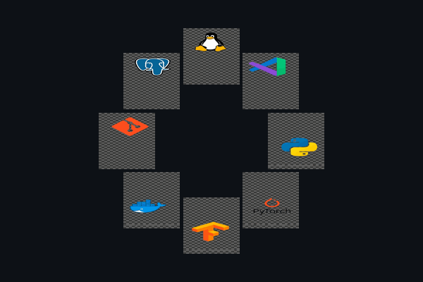

  

  

  

## 🚀 About Me

<table align="center">
  <tr>
    <td width="50%" valign="top">
      <h3>💻 What I'm Up To</h3>
      <ul>
        <li> <b>Developing:</b> <a href="https://github.com/Yigtwxx/Awesome-RAG-Production">Awesome-RAG-Production</a></li>
        <li> <b>Learning:</b> Advanced Deep Learning, MLOps, and Distributed Training</li>
        <li>👯 <b>Collaboration:</b> Eager to collaborate on innovative projects involving AI, Machine Learning, and Deep Learning, with a specific focus on NLP and Large Language Models (LLMs)</li>
      </ul>
    </td>
    <td width="50%" valign="top">
      <h3>🧠 Focus & Insights</h3>
      <ul>
        <li>🤝 <b>Seeking Help:</b> Model optimization and large-scale MLOps pipelines</li>
        <li>💬 <b>Ask Me About:</b> Python, PyTorch and Deep Learning.</li>
        <li>⚡ <b>Fun Fact:</b> I like breaking models to understand them better.</li>
      </ul>
    </td>
  </tr>
</table>

---

### 📩 Contact & Career

  &nbsp;
  </a>
  

<h3 align="left">Connect with me:</h3>

  &nbsp;
  &nbsp;
  

<h3 align="left">🛠️ Skills</h3>
<picture>
  <source media="(prefers-color-scheme: dark)" srcset="./Skills_Animation_Dark.gif">
  <source media="(prefers-color-scheme: light)" srcset="./Skills_Animation_White.gif">
  
</picture>

### Key Focus
- AI & ML Engineer with expertise in building deep learning systems for vision, language and real-world data
- Proficient in Python, PyTorch, TensorFlow, and modern ML frameworks
- Experienced in MLOps, distributed training, and production-ready AI systems
- Passionate about NLP and Large Language Models (LLMs)

 

  <h2>🐍 My Contributions</h2>
  

  <h2>🏆 GitHub Trophies</h2>
  

